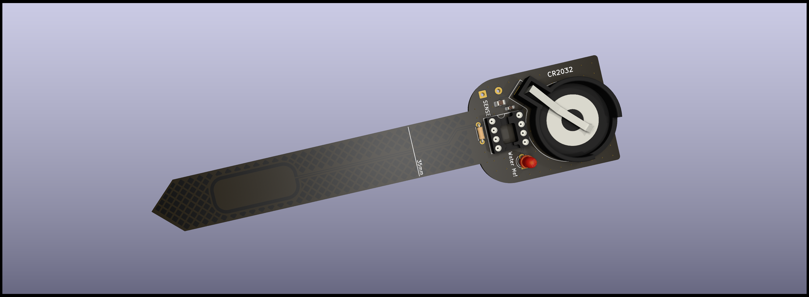
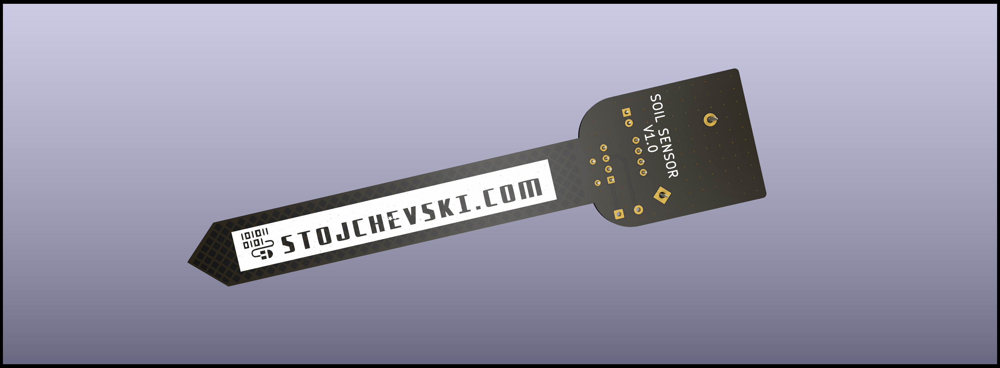

# Tiny Plant Sensor

The Tiny Plant Sensor 🌱 is a low-power sensor designed around the Attiny85 microcontroller and powered by a CR2032 coin cell battery. This sensor is designed to monitor the moisture level of a plant and provide a visual indication when watering is required.

## Features

- Utilizes Attiny85 microcontroller
- Powered by CR2032 coin cell battery
- Monitors plant moisture using capacitance level
- Sleeps and wakes up every 6 seconds for power efficiency
- Blinking LED indicates the need for watering

## Operation

The sensor operates by periodically waking up to check the plant's capacitance level, determining if watering is necessary. If the plant requires watering, the sensor activates a blinking LED every second. Otherwise, it remains in a low-power state.

## Usage

Simply deploy the Tiny Plant Sensor in the vicinity of the plant you wish to monitor. Ensure the CR2032 battery is properly inserted, and the sensor will autonomously manage its sleep-wake cycles to conserve power while providing visual cues for watering needs.

Feel free to customize and adapt the Tiny Plant Sensor for your specific plant monitoring requirements.
